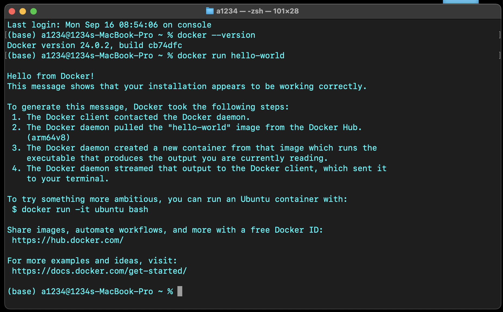

# Assignment 1, Web Application Development
## Intro to Containerization: Docker
### Exercise 1: Installing Docker

**Key components of Docker:**
  - **Docker Engine**: The core service that runs containers.
  - **Docker CLI**: The command-line interface to interact with Docker.
  - **Docker Hub**: A cloud registry to find and store Docker images.
  - **Docker Daemon**: The background service that manages containers.

- **Docker vs Traditional VMs**:
  - Docker uses **containers**, which share the host's OS and are lightweight.
  - **VMs** run a full OS for each instance and are heavier.
  - Containers start faster and use less system resources than VMs.

- **Output of `docker run hello-world`**:
  - It prints a message saying "Hello from Docker!".
  - It shows that Docker is installed correctly and is able to run containers.

  ### Exercise 2: Basic Docker Commands
  
