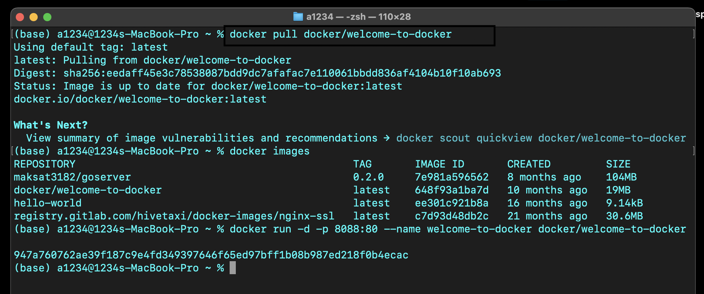
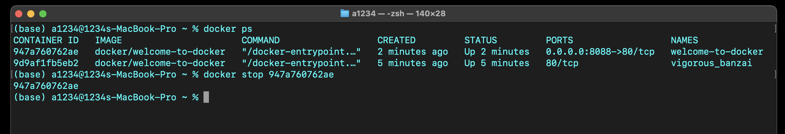
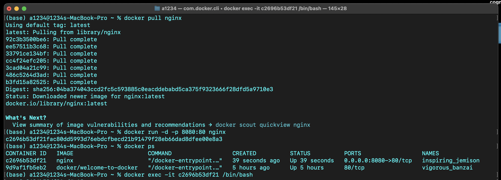
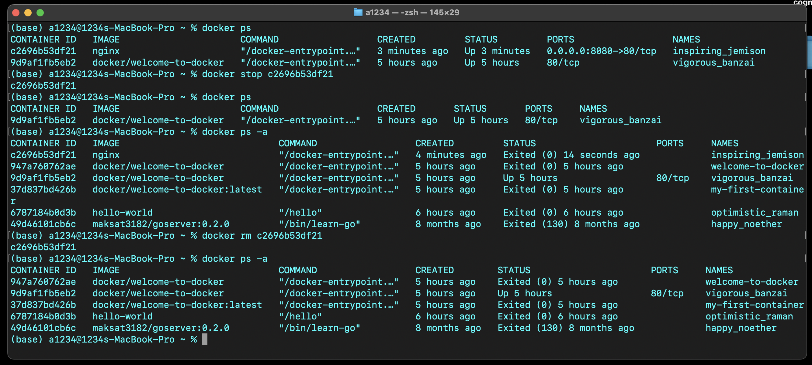

# Assignment 1, Web Application Development
## Intro to Containerization: Docker
### Exercise 1: Installing Docker

**Key components of Docker:**
  - **Docker Engine**: The core service that runs containers.
  - **Docker CLI**: The command-line interface to interact with Docker.
  - **Docker Hub**: A cloud registry to find and store Docker images.
  - **Docker Daemon**: The background service that manages containers.

- **Docker vs Traditional VMs**:
  - Docker uses **containers**, which share the host's OS and are lightweight.
  - **VMs** run a full OS for each instance and are heavier.
  - Containers start faster and use less system resources than VMs.

- **Output of `docker run hello-world`**:
  - It prints a message saying "Hello from Docker!".
  - It shows that Docker is installed correctly and is able to run containers.

### Exercise 2: Basic Docker Commands

- **Difference between `docker pull` and `docker run`:**
  - **`docker pull`**: Downloads a Docker image from a registry (like Docker Hub) to your local machine.
  - **`docker run`**: Creates and starts a container from a Docker image (automatically pulls the image if it’s not already downloaded).

- **Finding details of a running container (ID and status):**
  - Use the command **`docker ps`**. It shows container ID, status, names, and more details about running containers.

- **What happens after a container is stopped? Can it be restarted?**
  - The container remains on the system in a **stopped state**.
  - Yes, it can be restarted using **`docker start <container_id>`** without needing to create a new one.

### Exercise 3: Working with Docker Containers

- **Port mapping in Docker:**
  - Port mapping connects a **port on the host machine** to a **port inside the container** (e.g., `-p 8080:80` maps host port 8080 to container port 80).
  - It's important because it allows external access to services running inside the container.

- **Purpose of `docker exec`:**
  - It lets you **run commands** inside an already running container (e.g., open a shell or run scripts).

- **Ensuring a stopped container does not consume system resources:**
  - Remove the stopped container using **`docker rm <container_id>`**. This frees up disk space and prevents it from consuming resources.
